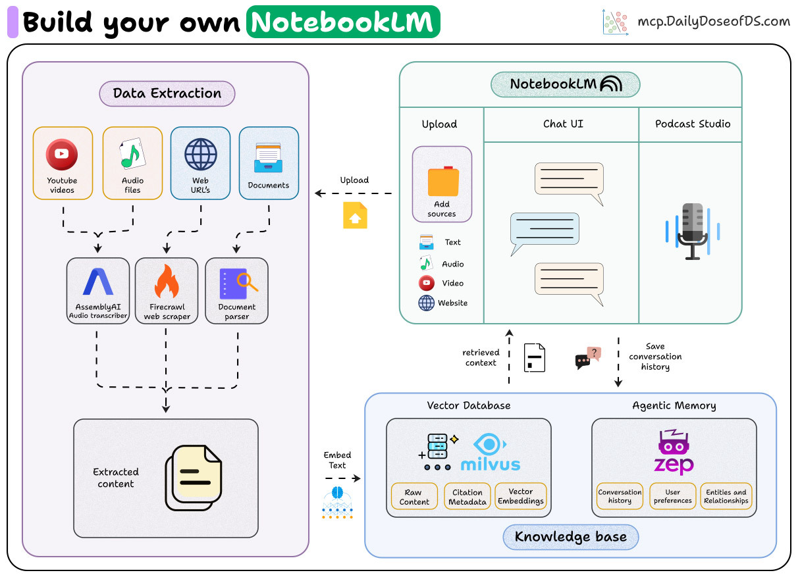
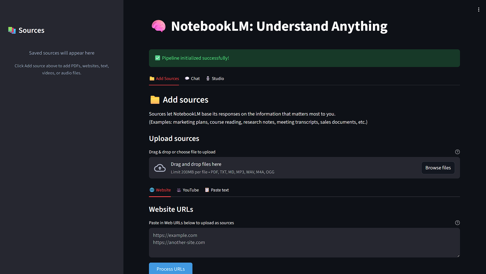

# NotebookLM Clone
In this project we build an open-source implementation of Google's NotebookLM that grounds AI responses in your documents with accurate citations. Built with modern AI technologies including RAG (Retrieval-Augmented Generation), vector databases, and conversational memory.

## Overview

NotebookLM Clone is a document-grounded AI assistant that allows you to:

- Upload and process multiple document types (PDF, text, audio, YouTube videos, web pages)
- Ask questions and receive cited, verifiable answers
- Maintain conversational context intelligently across sessions
- Generate AI podcasts from your documents
- Clean and intuitive web interface inspired by NotebookLM

### Tech Stack

- PyMuPDF for complex document parsing with PDF, TXT and Markdown support.
- AssemblyAI for audio transcription with speaker diarization.
- Firecrawl for scraping and content extraction from websites.
- Milvus vector database for efficient semantic search.
- Zep's temporal knowledge graphs as the memory layer.
- Kokoro as the open source Text-to-Speech model.
- Streamlit for the interactive web UI.

### NotebookLM UI

- NotebookLM-Inspired Design: Three-Panel Layout with sources panel, chat interface, and studio features.
- Add your documents via the Upload panel.
- Interactive source citations with detailed metadata in chat responses.
- Podcast Generation: AI podcast creation with script generation and multi speaker TTS

## Architecture



## Data Flow
1. Document Ingestion: User uploads PDF, audio, video, text, or web URL
2. Processing: Content extracted with metadata (page numbers, timestamps, and other metadata)
3. Chunking: Text split into overlapping segments preserving context
4. Embedding: Chunks converted to vector representations
5. Storage: Vectors stored in Milvus with citation metadata
6. Query: User asks question → Query embedded → Semantic search
7. Retrieval: Top-k relevant chunks retrieved with metadata
8. Generation: Agent generates cited response using memory
9. Memory: Conversation saved to Zep for future context

## Installation & Setup

**Prerequisites**: Python 3.11
    
1. **Install dependencies:**
    First, install `uv` and set up the environment:
    ```bash
    # MacOS/Linux
    curl -LsSf https://astral.sh/uv/install.sh | sh

    # Windows
    powershell -ExecutionPolicy ByPass -c "irm https://astral.sh/uv/install.ps1 | iex"
    ```

    Install dependencies:
    ```bash
    # Create a new directory for our project
    uv init notebook-lm
    cd notebook-lm

    # Create virtual environment and activate it
    uv venv
    source .venv/bin/activate  # MacOS/Linux

    .venv\Scripts\activate     # Windows

    # Install dependencies
    uv sync

    # Additional steps (recommended)
    uv add -U yt-dlp           # for latest version
    uv pip install pip         # pip for TTS model dependencies
    ```

2. **Set up environment variables:**
   Create a `.env` file with your API keys as specified in `.env.example` file:
   ```env
   OPENAI_API_KEY=<YOUR_OPENAI_API_KEY>
   ASSEMBLYAI_API_KEY=<YOUR_ASSEMBLYAI_API_KEY>
   FIRECRAWL_API_KEY=<YOUR_FIRECRAWL_API_KEY>
   ZEP_API_KEY=<YOUR_ZEP_API_KEY>
   ```

   Get the API keys here:
   - [Assembly AI →](https://www.assemblyai.com/)
   - [Zep AI →](https://www.getzep.com/)
   - [Firecrawl →](https://www.firecrawl.dev/)
   - [OpenAI →](https://openai.com)


## Usage
Running the Web Application
```python
uv run app.py or streamlit run app.py
```
The app will open at http://localhost:8501




## Project Structure
```
├── 📂 src/                            # Main source code
│   ├── 📂 audio_processing/           # Audio transcription and processing
│   │   ├── 🎵 audio_transcriber.py    # AssemblyAI audio transcription
│   │   └── 🎥 youtube_transcriber.py  # YouTube video transcription
│   │
│   ├── 📂 document_processing/        # Document parsing and chunking
│   │   └── 📄 doc_processor.py
│   │
│   ├── 📂 embeddings/                 # Vector embeddings generation
│   │   └── 🧠 embedding_generator.py
│   │
│   ├── 📂 generation/                 # RAG pipeline and response generation
│   │   └── 🤖 rag.py
│   │
│   ├── 📂 memory/                     # Conversation memory management
│   │   └── 🧠 memory_layer.py         # Zep memory integration
│   │
│   ├── 📂 podcast/                    # Podcast generation system
│   │   ├── 📝 script_generator.py     # Podcast script generation
│   │   └── 🎙️ text_to_speech.py       # TTS audio generation
│   │
│   ├── 📂 vector_database/            # Vector storage and search
│   │   └── 🗄️ milvus_vector_db.py
│   │
│   └── 📂 web_scraping/               # Web content extraction
│       └── 🌐 web_scraper.py          # FireCrawl web scraping
│
├── 📂 tests/                          # Pipeline integration tests
├── 📂 data/                           # Sample documents
├── 📂 notebooks/                      # Walkthrough notebook
├── 📂 outputs/                        # Generated content
├── 📂 assets/                         # Sample images
│
├── 📱 app.py                          # Main Streamlit application
├── 📋 pyproject.toml                  # Project configuration and dependencies
├── 📋 uv.lock                         # UV lock file
├── 🐍 .python-version                 # Python version specification
├── 📝 .env.example                    # Example configuration file
├── 📝 README.md                       # Project documentation
```

## Key Features

- **Citation-First Approach**: Every claim is backed by specific sources with page numbers and references as in the original NotebookLM.
- **Memory-Powered**: Uses temporal knowledge graphs to remember context and preferences during conversations.
- **Multi-Format Support**: Process PDFs, text files, audio recordings, YouTube videos and web content seamlessly.
- **Efficient Retrieval**: All relevant chunks retrieved intelligently along with citation metadata.
- **AI Podcast Generation**: Transform documents into engaging multi-speaker podcast conversations.

## 📬 Stay Updated with Our Newsletter!
**Get a FREE Data Science eBook** 📖 with 150+ essential lessons in Data Science when you subscribe to our newsletter! Stay in the loop with the latest tutorials, insights, and exclusive resources. [Subscribe now!](https://join.dailydoseofds.com)

[](https://join.dailydoseofds.com)

---

## Contribution

Contributions are welcome! Please fork the repository and submit a pull request with your improvements. 